# 1. About XTags.js

- Html5 custom tag system build by pure javascript class.
- Write html and easy layout with only tags & attributes.
- No class, No css, No nodejs.
- Author: surfsky.github.com 2024

[toc]


# 2. Usage

## See

-  [Example site](https://surfsky.github.io/xtags.js/)
-  [Code](./example/index.html)


## Include

``` html
<script src="./xtags.js" type='module' defer ></script>
```

## Code

``` html
<x-rect anchor="topLeft" childanchor='center'>topLeft</x-rect>
<x-row gap='20px' anchor="center" width="430px">...<x-row>
<x-col gap="20px" anchor='right'  width="130px" height="500px">...<x-col>
<x-grid columns='4'>...<x-grid>
<x-form>...<x-form>
```

## 3.Shotsnap

### Theme 

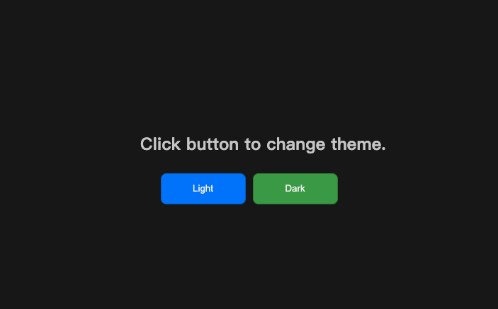
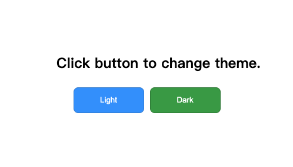


### Basic

#### Rect
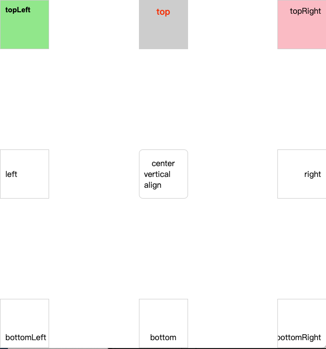

#### Circle
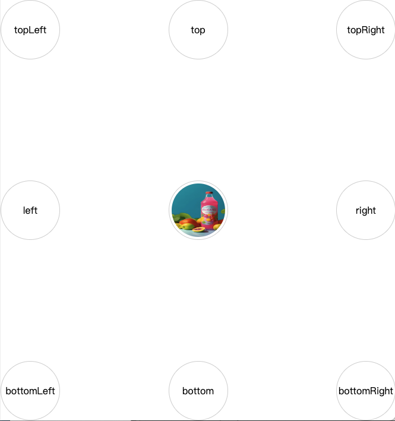

#### Image
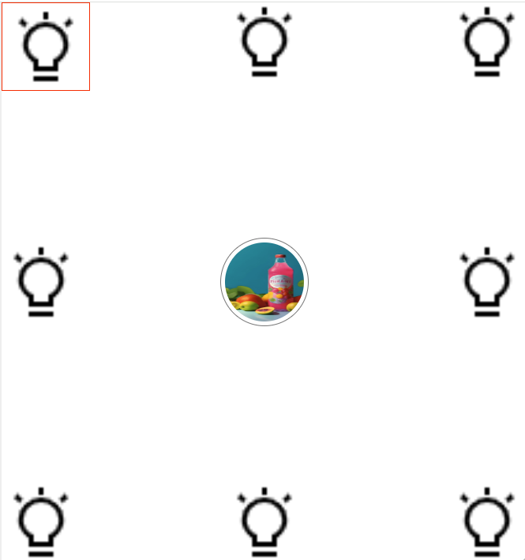

#### IconFont
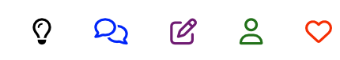


### Layout

#### Row Column Grid
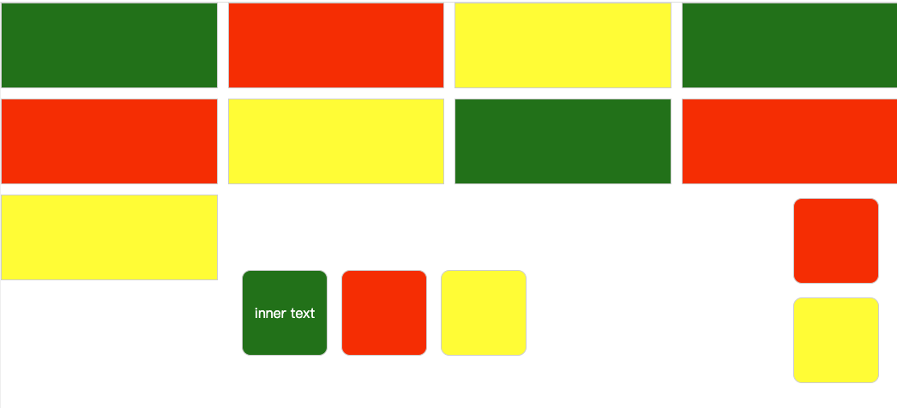

#### Responsive container


#### Responsive form
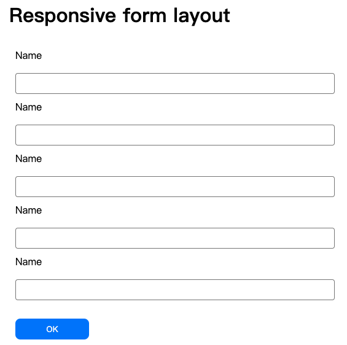
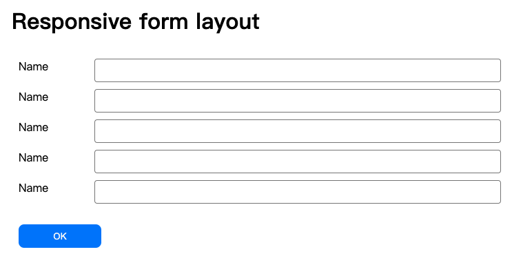
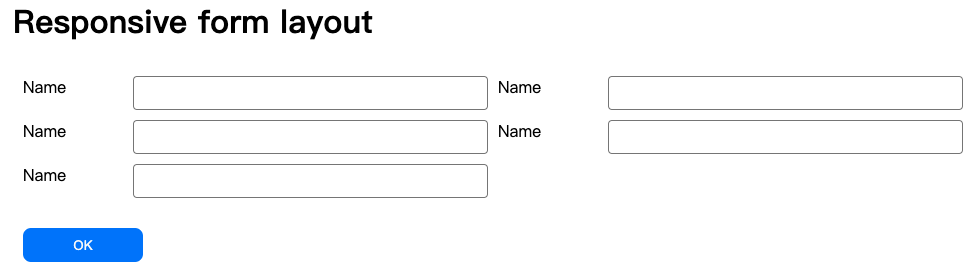

#### Responsive portal


#### Dashboard


#### Mobile


### Popup

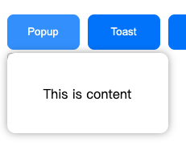
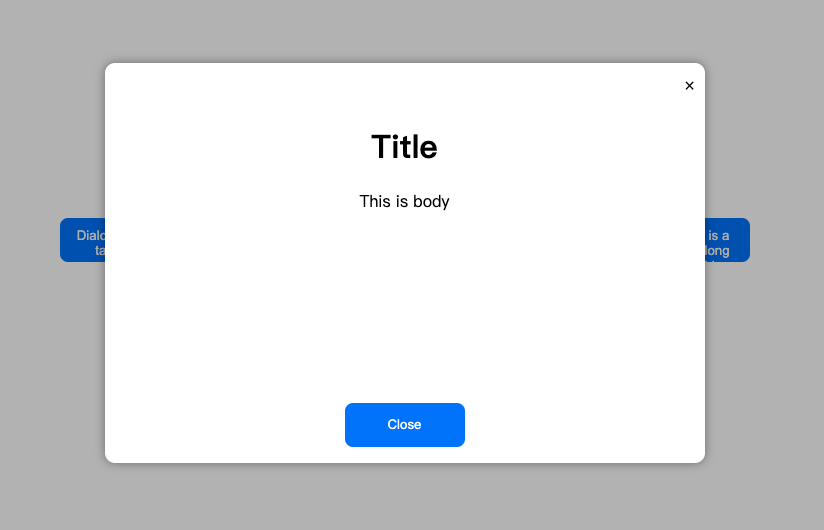
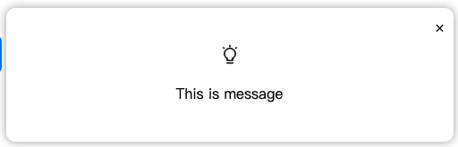
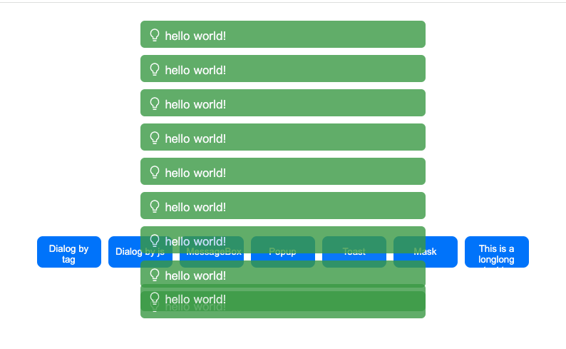
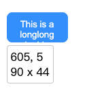
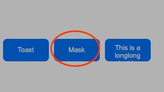


# 4. Features
-----------------------------------------------------

- Support tags
    - basic: tag, div, style
    - container: rect, circle, container, row, col, grid, form, frame
    - control: image, icon, link
    - popup: toast, mask, dialog, messagebox, popup, tooltip
    - form: button

- Support tag attributes
    ```
    // basic
    'id', 'name', 'class', 'newclass', 'z', 'opacity', 'visible', 'overflow', 'cursor',

    // box module
    'box', 
    'margin',  'margintop',  'marginright',  'marginbottom',  'marginleft', 
    'padding', 'paddingtop', 'paddingright', 'paddingbottom', 'paddingleft', 
    'width', 'height', 'minwidth', 'minheight', 'maxwidth', 'maxheight',
    'border', 'borderwidth', 'bordercolor', 'borderstyle', 'radius',  

    // position
    'position', 'dock', 'anchor', 'fixanchor', 'top', 'bottom', 'left', 'right',  

    // child position
    'display', 'childanchor', 'textalign', 'flex', 'gridcolumn',

    // theme
    'theme', 
    'background','bgcolor', 'bgimage', 'bgrepeat', 'bgposition', 'bgsize',
    'color', 'font', 'fontsize', 'fontfamily', 'fontstyle', 'fontweight',

    // data
    'title', 'tip',

    // effect
    'shadow', 'transform', 'rotate', 'scale', 'skew', 'textshadow',
    'hoverbgcolor', 'hovercolor',

    // event
    'click', 'draggable',
    ```

- Control attributes:
    - Button attributes
        - ripple : show click ripple effect
        - asyncclick : click > disable button > wait for excute finished > enable button.
    - Image
        - avatar
        - icon

- Support animation
    - XTags support all attribute animation for position, size, color...
    - Support extra animation effects, eg. Hover color, click ripple...
        ``` html
        <x-rect bgcolor="lightred"  hoverbgcolor="lightblue" >
            hover to change color
        </x-rect>
        ```
    - Use animate() function to apply animation: 
        ``` js
        <x-rect bgcolor="lightgreen" click="animate(this)" id="rect1">
            click to change color
        </x-rect>
        function animate(ele){
            ele.animate(()=> ele.style.backgroundColor = getRandomColor());
        }
        ```

- Support Theme
    ``` js
    import {XTags} from "xtags-base.js";
    XTags.setTheme(new Theme({
        name        : 'MaterialDark',
        text        : '#cccccc',
        textLight   : '#f0f0f0',
        background  : '#171717',
        link        : 'red',
        linkHover   : 'green',
        linkVisited : 'gray',
        primary     : '#007bff',
        secondary   : '#7633d4',
        success     : '#28a745',
        info        : '#17a2b8',
        warning     : '#ffc107',
        danger      : '#dc3545',
        dark        : '#343a40',
        light       : '#f8f9fa',
        border      : '1px solid #707070',
        radius      : '8px',
    });
    ```

    Custom tag should override setTheme(t) function, such as:
    ``` js
    setTheme(t){
        this.root.style.color = t.text;
        switch (this.root.themeCls){
            case "primary":   this.root.style.backgroundColor = t.primary;     break;
            case "secondary": this.root.style.backgroundColor = t.secondary;   break;
            case "success":   this.root.style.backgroundColor = t.success;     break;
            case "info":      this.root.style.backgroundColor = t.info;        break;
            case "warning":   this.root.style.backgroundColor = t.warning;     break;
            case "danger":    this.root.style.backgroundColor = t.danger;      break;
            default:          this.root.style.backgroundColor = t.background;  break;
        }
        return this;
    }
    ```


#5. Extension
-----------------------------------------------------

# Display any tag with x-tag

Juse use x-tag and set attribute tagname='sometag'. eg.

    ``` html
    <x-tag tagname="pre" width='100%' overflow='scroll'>
        ...
    </x-tag>
    ```

# Shadow mode or inplace mode?


Difference between shadow-mode and inplace-mode:

- Inplace mode: Create tags in doucment body, and replace the raw x-xxx tags. This mode can be compatible with third-party libraries. The most xtags are build by *inplace mode*, excepting some complex control, such as dialog、messagebox、popup.

- Shadow mode: Create tags in shadowDOM, include tags, style, javascript, etc. The advantage is selffolded and poluteless to page. The disadvantage is caused by isolation that the inner elements can't be visited by js search function(eg. document.querySelector()) and page css。 The mode may cause some questions：
    - The page css can't not effect shadow-mode tag's inner element's style.
    - Three-party library (such as highlight.js) work fail.
    - IFrame in xtags can't be expanded auto. <a target='iframename'> can't be worked.
    - Can't get items's real position in XTags container (such as x-row in popup.html)

- If you want to specify a certain mode, to set the attribute 'useshadow'. eg.

``` html
<x-form useshadow='true'>....</x-form>
```

- Build custom tag:

steps

- Create class extend Tag.
- Override createRoot(), createStyle(), setTheme() if need.
- Regist customElements by `customElements.define("x-tagname", ClassName);'.

eg.
```
export class Container extends Tag {
    constructor() {
        super();
    }

    createRoot(){
        this.root = document.createElement('div');
        this.root.innerHTML = this.innerHTML;
        this.root.style.transition = 'all 0.5s';   // animation
        return this.root;
    }

    createStyle(){
        this.root.id = this.getId();
        const style = document.createElement('style');
        style.textContent = `
            #${this.root.id} {
                width: 100%;
                margin-left: auto;
                margin-right: auto;
                padding-left: 15px;
                padding-right: 15px;
                }
                /* Responsive container 540-720-960-1140 */
                @media (min-width: 576px)  { #${this.root.id}   {max-width: 540px;}}  /*xs*/
                @media (min-width: 768px)  { #${this.root.id}   {max-width: 720px;}}  /*s*/
                @media (min-width: 992px)  { #${this.root.id}   {max-width: 960px;}}  /*m*/
                @media (min-width: 1200px) { #${this.root.id}   {max-width: 1140px;}} /*l*/
                @media (min-width: 1500px) { #${this.root.id}   {max-width: 1400px;}} /*xl*/
                @media (min-width: 1800px) { #${this.root.id}   {max-width: 1700px;}} /*xxl*/
                @media (min-width: 2000px) { #${this.root.id}   {max-width: 1900px;}} /*xxxl*/
        `;
        return style;
    }
}

customElements.define("x-container", Container);
```


#6. Task
-----------------------------------------------------
```
完善icon-font，允许下载本地字体并显示。
实现Penel extends Rect: resizable，dragable
实现SlidePanel，滑入，一般是不允许拖动的，可以调整大小。

优化dialog
    提供标题栏供拖动
    实现dialog buttons and dialogResult
    提供resize属性以及其它属性供用户自己设置
button showRipple 改用方法来写，不用css，并改为异步的。
完善link，动态修改色彩
实现SideDialog，靠边刷出，高度填满，顶部或底部固定放置
实现移动端相关面板组件

temple
drag
swipe
control
    switch
    groupbutton
    textbox
shape
实现 react、vue那样的组件生成方式


Q：如何回收自动创建的style标签？
    删除前没有事件或方法可以调用
    删除后，标签都不存在了，属性和方法都不能调用了
    唯有静态成员还存在，那只能用class方式了
    注：ripple.animateend 方法会自动释放

child sortable
发布build min.js
备选名称：classless.js, noclass.js, cssless.js, onlytags.js
```


#7. History
-----------------------------------------------------
```
/Fixbug: Rectangle, Circle 偏心了。
/解决row/column 容器中 rect click 事件失效的问题（但button不会，奇了怪了）
    row/column 用 cloneChildNodes,  事件ok
    button 用 cloneChildNodes 显示不出来，用 innerHtml ok
    这里面有个顺序问题
    改用 this.insertChild(this.root) 方式来改造，这样xtag本身的事件和方法不会丢失，生成的子控件
/发布 github pages：https://surfsky.github.io/xtags.js/
/解决style重复写的问题。
/layout-dashboard 改为 anchor 模式
/实现dock 属性：top, right, bottom, left
/解决click事件会穿透到父节点的问题
/用 ajax 简化页面代码显示，再用个iframe吧
/bgimage
       background-image: url('path/to/your/image.jpg');
       background-repeat: no-repeat;
       background-position: center;
/实现iconfont, x-icon
/优化tootip，支持：textContext、attribute、callback
/修复 dialog、messagebox、Popup
/让dialog 使用shadow模式，自封装让页面更干净。
/显示页面源码
/解决重入几次的问题：button.html
/button按钮有点问题，有的可以正常，有的不行（如setTheme）。 要不增加一个 asyncclick ？
/完善 theme，可设置 border 组合属性，增加textLight 属性
/inplace 模式注意事项
    /把方法都写在root下面，避免 inplace 模式导致方法丢失
    /增加一个styleid属性？把 styleTag 挂在root下面
/全局自动注入 boxsizing、transition css，弄个开关。算了，用<style>标签吧，让用户自己设置。
/toast 的 style 需要回收，算了，不设置row 的 gap属性了。
/修复 Theme     遍历节点，setTheme方法丢失了，看是否把这个方法附在root下面
/fixanchor 固定在页面，不跟随父节点
/修复 Toast
/测试原地替换dom方式，而不是在shadow中创建，以避免shadow导致的隔离影响
    思路
        提供属性 render = Shadow | Body
        对于自己的样式控制，直接写没关系
        对于子类的渲染，需要给一个guid，并输出对应的 style 标签
    逐步修正。主要是查 shadowRoot
        /Style       需提供全局 box-sizing 模式，全屏设置，1em设置，响应容器设置
        /Link       按钮无法显示
        /Rectangle   点击动画
        /Circle      中间的圆显示不正常
        /Image
        /Icon
        /Button
        /Row       影响属性 gap
        /Column    影响属性 gap
        /Form
        /Mask
/实现 Container   响应式布局
/button 继承至 tag，且生成 <button> 标签
/按钮文字不可选择 user-select: none
/Button long time execute
/drag - dialog
/animation: Tag.animate(...)
/dragable
/resizable
/messagebox
/dialog
/unique id 对于动态创建的控件，自动生成一个唯一性ID，或者不用也行，用this.root 保存吧。
/layout-form
/弄个虚拟基类Tag，实现所有css
    Rect、Circle，butten
    Style、
    row、col，grid
/删除this.shadow，直接用 this.shadowRoot
/尝试用grid布局来写index.html
/Link hover、visited color
/Mask
/注入全局样式。或弄一个全局配置标签。
/x-img 也可以考虑支持icon，命名方式如：theme-iconname.xxx
/用 ITheme 接口改造 Rect，算了用约定吧
/用 Toast.show() 静态方法来展示 Toast
/image
/重构类库结构：base、baseui、control、util...
/Rect.fix -> anchor

```